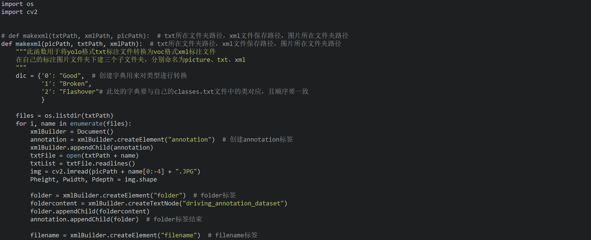

# 目标检测+图像分类数据增强集成

#### 介绍
这是一个目标检测与图像识别数据增强仓库，包括亮度、对比度、HSV增强，MOSCI马赛克增强，平移、错切、仿射变换增强等多种方法的集成

#### 使用说明
# 项目结构整理

**运行setup.py,自动创建所需文件夹**

# 亮度，对比度，HSV调整

## 第一步

进入**BASICmore_data**文件夹

 **.txt**文件放**labels**中， **.jpg**放**smallimage**中，运行 **MOREdata.py** 
可在第一步前用**toJPG.py**转其他图片为jpg，查看代码注意新文件夹路径，默认需要新建一个文件夹

## 第二步

运行完成后**txt**在**morelabels**中，**jpg**在**moreimage**中

​#注意#​上述步骤默认**亮度，对比度，hsv**增强，各3次，修改**MOREdata.py**的**num变量**来修改次数

次数较多可对函数里的**随机数**进行**优化**

​注意：亮度对比度的改变在1.1到1.4，0.6到0.9，正常的图肉眼看上去还是认得出的（视整体数据情况，可以先抽取几张测试，再决定范围）

‍

# 图像分类数据增强

方法同亮度等，**MOREdata.py**已集成**平移、侧切、翻转、仿射变换**等操作，适当修改**MOREdata.py**即可

注意：图像分类不需要标注文件

‍

# MOSIC增强

## 第一步

把要增强的文件放到**VOCdevkit/VOC2007**​里， **.txt**文件放**labels**， **.jpg**文件放**JPEGImages**	

提前把不是 **.jpg**的文件转成 **.jpg**或者把它和对应的txt文件一起删除，或使用**toJPG.py**进行转换

## 第二步

运行**1yolo2voc.py**
注意：​运行之前按照格式改成数据的类别：

​

## 第三步

运行**2generate_mosaic.py**，运行前改**Out_Num**变量，想要几张就改几张（增强为多少张），可以先小量调试，**跑起来500张中等配置需要30s左右**

## 第四步

运行**3split.py**，可改**train_percent**变量，这是训练集的比例，也可直接设为1.0

## 第五步

运行**4vol_plus.py**，运行之前按格式改**classes，** 最后的训练数据集 **.txt**文件在**mydata/dataset**中

‍

[参考项目](https://github.com/bubbliiiing/object-detection-augmentation)
